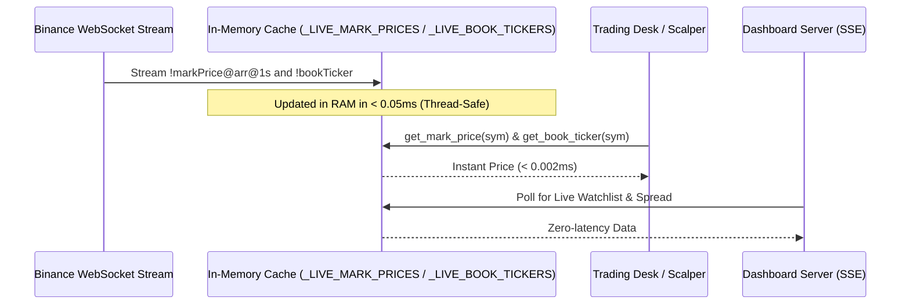
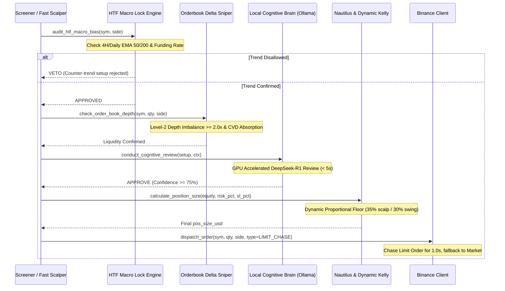

# Belajar Kripto — Data Pipelines & Execution Flows (Graft)

This document details how data moves through the workstation: from market feeds to order routing, risk checks, and telemetry.

---

## 1. Real-Time Market Feed Pipeline (< 0.05ms In-Memory RAM Cache)

---

## 2. Pre-Trade Execution Pipeline & Risk Haircuts

---

## 3. Post-Trade Lifecycle & Telemetry Persistence

1. **Order Fill**: `binance_client.py` captures execution ticket.
2. **Fast Position Watcher**: Background daemon thread monitors open positions every 8 seconds.
3. **Adaptive Profit Harvest & Micro-BE**:
   - At $+0.8	ext{R}$: Moves Stop Loss to Breakeven (Zero Capital Risk).
   - At $+1.5	ext{R}$: Harvests partial TP1 (40%).
   - At $+2.0	ext{R}$: `pyramiding_engine.py` evaluates adding +30% runner size.
4. **Trade Journal Logging**:
   - On position close, logs trade record to `data/trade_journal_ledger.json`.
   - Triggers `self_improve.py` (ATLAS Karpathy Autoresearch Loop) to update Sharpe ratio, win rate, and expectancy.
5. **Dashboard SSE Stream**:
   - `dashboard_server.py` pushes updated telemetry to `dashboard.html` over Server-Sent Events (`/api/stream/events`).
