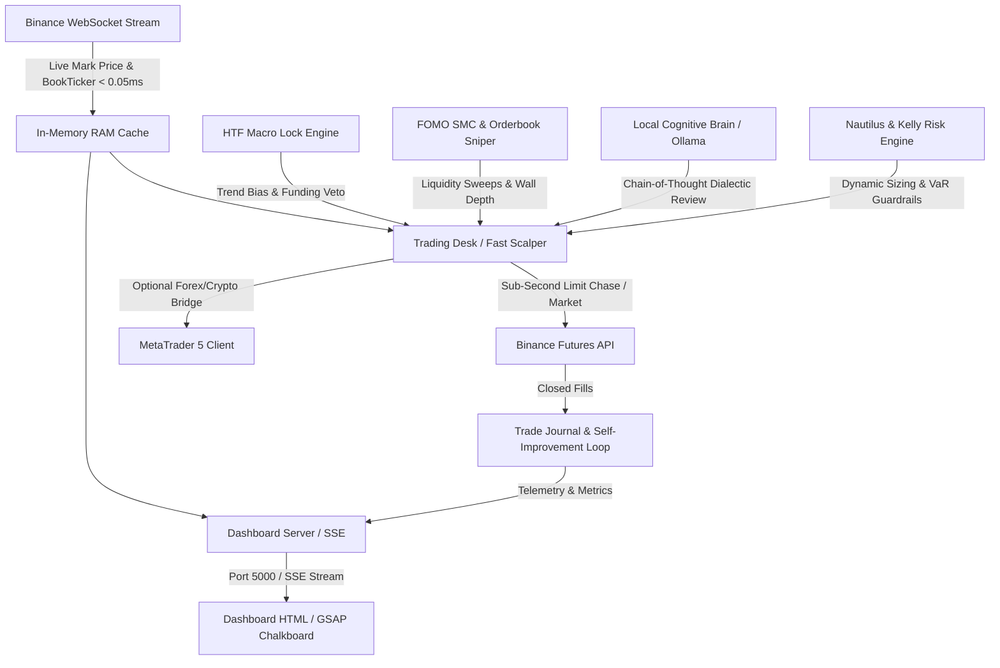

# Belajar Kripto — Architectural Overview (Graft Knowledge Graph)

> **Context Layer for AI Coding Agents**: This document provides an oriented architectural map of the **Belajar Kripto** institutional trading and research workstation. Generated dynamically on 2026-09-21 01:56:43.

---

## 1. System Vision & Architecture

Belajar Kripto is an institutional-grade autonomous crypto trading, screening, and research workstation synthesized from the **Akademi Crypto curriculum** and real-time **Binance Futures API** (with MT5 client support).

---

## 2. Core Subsystems

### A. Execution & Trading Desks
- **[`trading_desk.py`](file:///.agents/tools/trading_desk.py)**: The central 1H swing trading engine. Evaluates relative strength radar, applies HTF macro lock, validates Nautilus pre-trade risk, sizes positions with Dynamic Proportional Floor (35% scalp / 30% swing), and routes orders to Binance / MT5.
- **[`fast_scalper.py`](file:///.agents/tools/fast_scalper.py)**: 5m/15m high-frequency scalper implementing Opening Range Breakout (ORB V4.1), Order Flow CVD Absorption, Micro-Breakeven (+0.8R), and Session Kill Zones.
- **[`launcher.py`](file:///.agents/tools/launcher.py)**: Interactive CLI launcher providing operational modes including `[4] LONG-ONLY HYBRID AUTOPILOT`.
- **[`watchdog_supervisor.py`](file:///.agents/tools/watchdog_supervisor.py)**: High-reliability daemon supervisor that auto-restarts crashed services, monitors port health, and sends Telegram healing alerts.

### B. High-Frequency Market Microstructure & Feeds
- **[`binance_ws_stream.py`](file:///.agents/tools/binance_ws_stream.py)**: Combined WebSocket stream (`!markPrice@arr@1s` and `!bookTicker`) streaming 300+ pairs into thread-safe RAM cache (< 0.05ms read latency).
- **[`binance_client.py`](file:///.agents/tools/binance_client.py)**: Authenticated signed REST/WebSocket client featuring fast-path orderbook depth checks, sub-second `LIMIT_CHASE` (1.0s max), and exchange precision filters.
- **[`orderbook_delta_sniper.py`](file:///.agents/tools/orderbook_delta_sniper.py)**: Level-2 orderbook imbalance reader (bids/asks ratio $\ge 2.0	imes$) and CVD absorption sniper.

### C. Technical Analysis, SMC & Multi-Timeframe Confluence
- **[`htf_macro_lock.py`](file:///.agents/tools/htf_macro_lock.py)**: Strict macro trend gating. Enforces 4H/Daily EMA 50/200 alignment, vetoes counter-trend shorts, and applies negative funding rate penalties.
- **[`fomo_smc_engine.py`](file:///.agents/tools/fomo_smc_engine.py)**: 14-Course Master SMC detecting Inducement (IDM), Institutional Funding Candles (IFC), Rejection Blocks, and Fair Value Gaps (FVG).
- **[`adaptive_indicators.py`](file:///.agents/tools/adaptive_indicators.py)**: Kaufman Adaptive Moving Average (KAMA) and Volatility-Adjusted Adaptive RSI.
- **[`regime_adaptive_switcher.py`](file:///.agents/tools/regime_adaptive_switcher.py)**: Dynamic market regime classifier (Hyper-Trending, Moderate Trend, Ranging Consolidation, Volatile Chop) that adapts target R:R (1:2.0 to 1:5.0) and pyramiding permissions.

### D. Institutional Risk Management & Capital Preservation
- **[`nautilus_risk_engine.py`](file:///.agents/tools/nautilus_risk_engine.py)**: Pre-flight order validation, spread haircut, and slippage guard.
- **[`monte_carlo_risk_simulator.py`](file:///.agents/tools/monte_carlo_risk_simulator.py)**: 1,000-path bootstrap simulation regulating 95% VaR drawdown and dynamic risk haircuts.
- **[`pyramiding_engine.py`](file:///.agents/tools/pyramiding_engine.py)**: Adds +30% position size at +2R when Stop Loss is locked beyond Breakeven (Zero Capital Risk).
- **[`dynamic_beta_hedger.py`](file:///.agents/tools/dynamic_beta_hedger.py)**: Beta-neutral portfolio delta ($USD\Delta$) manager that deploys BTC short hedges during flash crash shocks.

### E. Local Cognitive AI & Consciousness
- **[`local_cognitive_brain.py`](file:///.agents/tools/local_cognitive_brain.py)**: Universal connector for local Ollama / LM Studio. Features GPU Hardware Profiling (RTX 5070 12GB vs GTX 1660 6GB), 60m keep-alive, `<think>` optimization, and asynchronous background review workers.
- **[`ai_risk_officer.py`](file:///.agents/tools/ai_risk_officer.py)**: Senior AI Quant Officer orchestrating dialectical bull-vs-bear debates before order clearance.

### F. Telemetry & User Interface
- **[`dashboard_server.py`](file:///.agents/tools/dashboard_server.py)**: High-performance HTTP and Server-Sent Events (SSE) server on port 5000 exposing 40+ REST endpoints.
- **[`dashboard.html`](file:///dashboard.html)**: GSAP® Animated Chalkboard single-page terminal adhering strictly to `DESIGN.md`.

---

## 3. Most Connected Modules (Central Hubs)

| Module | Purpose | Inbound Importers | Outbound Dependencies |
| :--- | :--- | :--- | :--- |
| [`market_eyes.py`](file:///.agents/tools/market_eyes.py) | Market Eyes (Mata Agent) - Institutional Market Intelligence Engine Fetches... | **13 modules** | 5 modules |
| [`binance_client.py`](file:///.agents/tools/binance_client.py) | Binance Demo & Live Futures Trading Client (Multi-Account Enabled) Supports... | **11 modules** | 2 modules |
| [`binance_ws_stream.py`](file:///.agents/tools/binance_ws_stream.py) | Native Binance Futures WebSocket Streaming Engine (< 50ms) Maintains a pers... | **9 modules** | 0 modules |
| [`ai_risk_officer.py`](file:///.agents/tools/ai_risk_officer.py) | AI Senior Quant Risk Officer & Autonomous Co-Pilot Synthesizes Akademi Cryp... | **7 modules** | 8 modules |
| [`coinglass_derivatives.py`](file:///.agents/tools/coinglass_derivatives.py) | CoinGlass & Coinalyze Institutional Derivatives Intelligence Engine Provide... | **7 modules** | 0 modules |
| [`telegram_notifier.py`](file:///.agents/tools/telegram_notifier.py) | Telegram Real-Time Alert & Two-Way Remote Control Notifier Bridges Autonomo... | **7 modules** | 19 modules |
| [`agent_memory_engine.py`](file:///.agents/tools/agent_memory_engine.py) | agent_memory_engine.py - Autonomous Persistent Memory & Cognitive Reflectio... | **6 modules** | 1 modules |
| [`trade_journal.py`](file:///.agents/tools/trade_journal.py) | Automated Trade Journal & Performance Analytics Engine Synthesized from Aka... | **6 modules** | 4 modules |
| [`macro_news_shield.py`](file:///.agents/tools/macro_news_shield.py) | Economic Calendar & Macro News Shield (High-Impact Volatility Guard) Protec... | **5 modules** | 0 modules |
| [`market_structure.py`](file:///.agents/tools/market_structure.py) | SMC Market Structure & Structural Trailing Stop Engine Synthesized from Aka... | **5 modules** | 1 modules |
